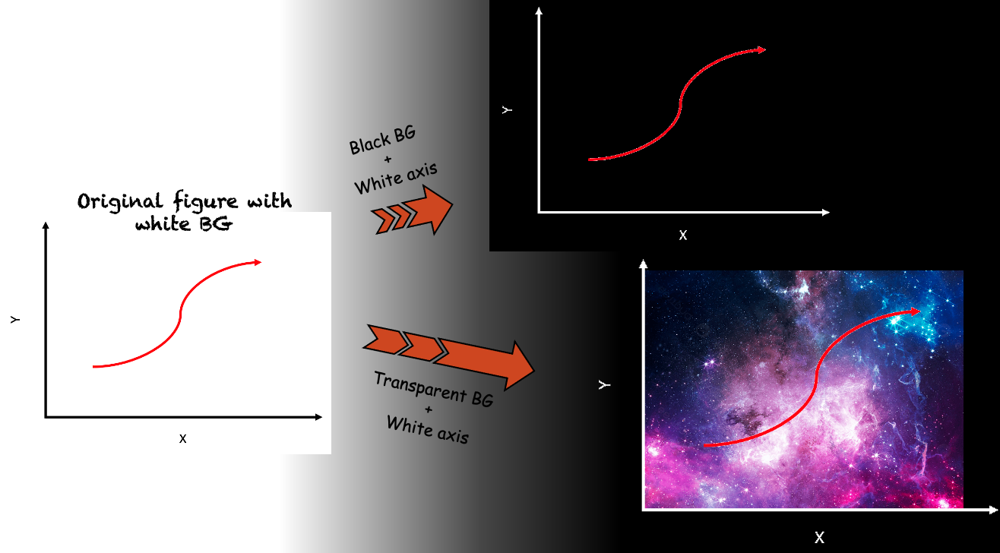

# Transparent Background Image Processor

This Python script processes an input image to:
- Make near-white background pixels fully **transparent**
- Convert near-black lines to **solid white and fully opaque**

It is especially useful for cleaning up scanned sketches, diagrams, or handwritten notes on white paper to prepare them for overlay on other media or for better digital presentation.

## ✨ Features

- Automatically detects and removes white background.
- Enhances black/gray lines by converting them to clean white.
- Outputs a `.png` image with transparency preserved.

## 🧰 Requirements

- Python 3.7+
- [OpenCV](https://pypi.org/project/opencv-python/)
- [NumPy](https://pypi.org/project/numpy/)

Install dependencies with:

  ```bash
  pip install opencv-python numpy
  ```

## 🚀 Usage

1. Place your input image (e.g., `example.png`) in the same directory as the script.
2. Open `make_transparent.py` and set the `image_path` variable to your file.
3. Run the script:

    ```bash
    python make_transparent.py
    ```

4. The output image will be saved as example_transparent.png in the same directory.

## 📂 Example

This script is perfect for adapting figures, plots, or scanned sketches for presentations with custom color schemes.

- Easily adjust which colors to make transparent or opaque by editing the RGB threshold values in the code.
- Ideal for removing backgrounds from diagrams or converting dark ink to brighter colors for clean overlays.





